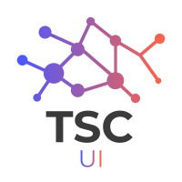
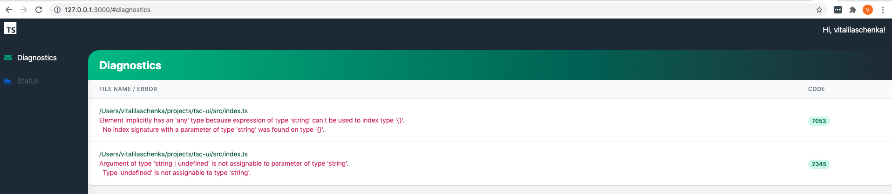
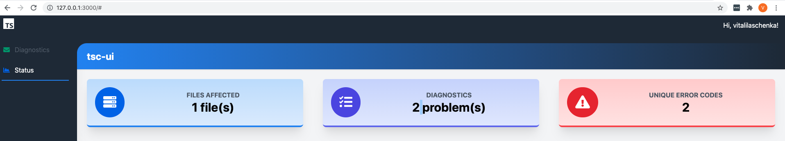

# TSC-UI

**TSC UI** is a tool to monitor in realtime your typescript project quality.

It is based on the original tsc compiler and uses it in the background in watch mode to
collect issues and return back to the console.

Currently available features:

- could show diagnostics messages list
- calculate the number of affected files
- calculate the number of unique error codes in the project
- open the problematic file in the VSCode by clicking on the file path
- find in Google the error code explanation by clicking on the error code number
- works in watch mode and updates automatically the dashboard
- battle-tested on a real project with 350+ diagnostics messages
- you could have any port for the dashboard using argument
- you could have any project path to the tsconfig.json using argument
- has zero dependencies on installation, except Typescript itself as peer dependency and [Tailwindcss](https://tailwindcss.com/) with [Fontawesome](https://fontawesome.com/) loaded as external links
- allows overriding of used tsconfig options by passing default tsc cli flags [default command line TSC options](https://www.typescriptlang.org/docs/handbook/compiler-options.html), e.g. run `tsc-ui --strict` to run compiler in strict mode

## Installation

For local install: `npm install tsc-ui`  or `yarn add tsc-ui`

For global install: `npm install -g tsc-ui` or `yarn global add tsc-ui`

**Note**: you should have `typescript` as dependency or have it installed globally, 
as `tsc-ui` requires it as peer dependency.

## Usage

Run `tsc-ui` in terminal in the typescript project directory.  

### Diagnostics page

In this page you could find current problems in your codebase.

Bonus features:

- you could click on the file path and it will open it in VSCode
- you could click on the error code to find it's explanation in Google

### Project Status page

In this page you could get your overall project analytics

## Configuration

By default, `./tsconfig.json` is used and port `3000` is taken for `tsc-ui-dashboard`.

You could override the tsconfig path and port of the dashboard service:

`--config=../../tsconfig.dev.json --port=4242`

## Use cases

You may, e.g. need this tool in case you want to have a dashboard reporting status with different tsconfig options 
than you have in the project.

Just run with **--strict** flag   `tsc-ui --strict` to run compiler in strict mode and monitor the errors.
